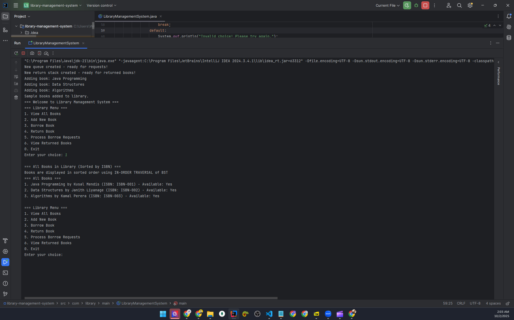
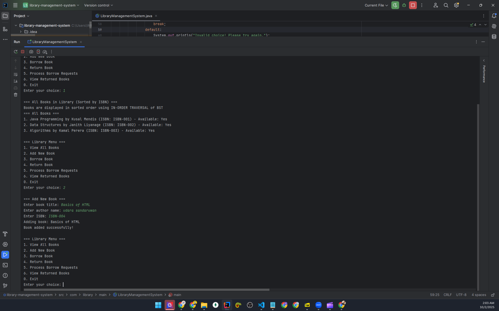
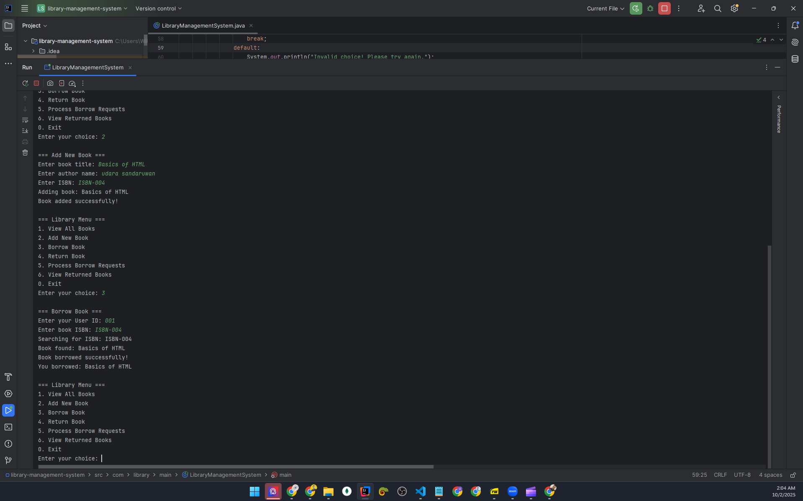
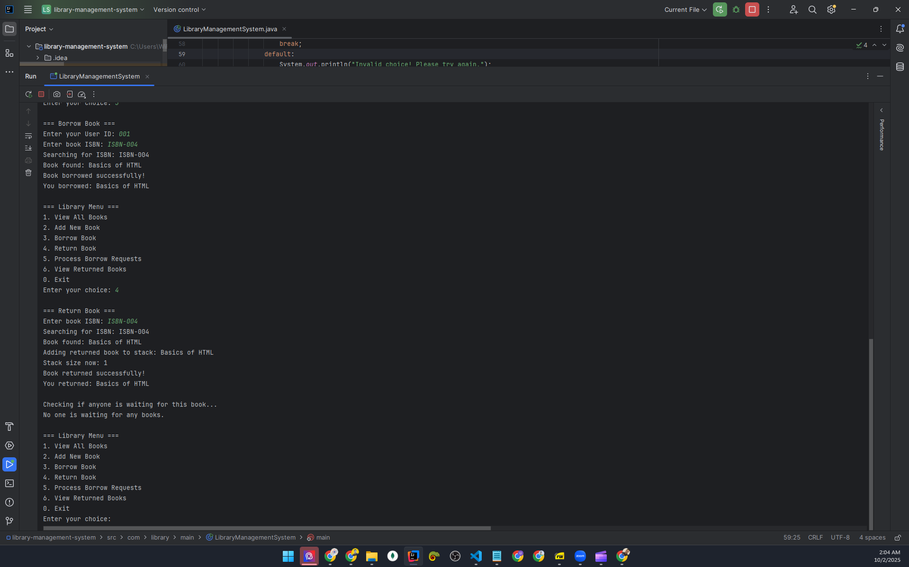
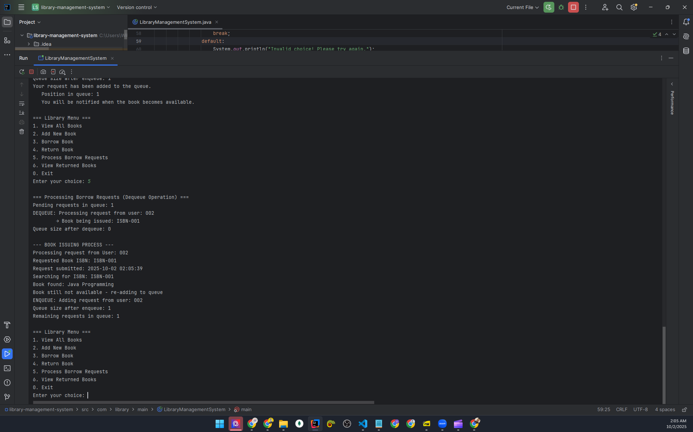
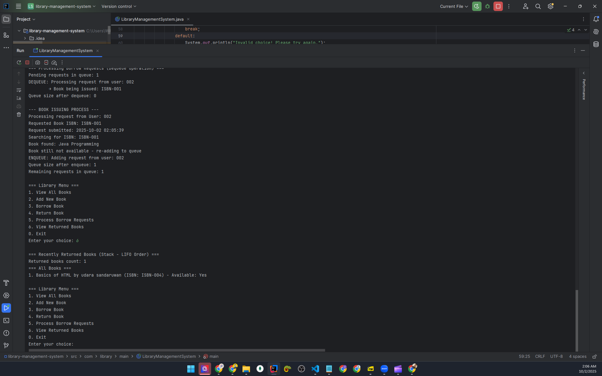

# 📚 Library Management System - DSA Assignment

**Student ID:** 22UG3-0002  
**Course:** CIT300 - Data Structures and Algorithms  
**Assignment:** Mid-term Assignment

## 🎯 Project Overview

A complete Library Management System built from scratch using custom data structures. This project demonstrates comprehensive understanding of fundamental DSA concepts without using any predefined Java collections.

## ✨ Key Features

- 🌳 **Binary Search Tree** - Auto-sorted book storage with in-order traversal
- 🔄 **Queue** - Fair book request handling with FIFO processing
- 📚 **Stack** - Recent returns tracking with LIFO behavior
- 🔗 **Linked List** - Flexible user history management
- 🚫 **Zero Predefined Collections** - All data structures built from scratch

## 🏗️ Custom Data Structures

### 1. Binary Search Tree (BookBST)
Binary Search Tree is like a smart filing system - smaller values go left, bigger values go right. When we want to see all books sorted, we use in-order traversal which visits left side first, then current book, then right side. This automatically gives us books in perfect ISBN order without using ArrayList. It's fast to search and keeps everything organized by itself.

### 2. Queue (BorrowRequestQueue)
Queue is like a line at a coffee shop - first person in line gets served first. When someone wants to borrow an unavailable book, we use enqueue to add their request to the back of the line. When the book becomes available, we use dequeue to remove the first person from the front and actually give them the book. This ensures fairness with FIFO behavior - first in, first out.

### 3. Stack (ReturnStack)
Stack is like a pile of plates - you can only add or remove from the top. When books are returned, we push them onto the top of the stack. When we want to see recently returned books, we look at the stack from top to bottom, showing the most recent returns first. This gives us LIFO behavior - last in, first out.

### 4. Linked List (UserHistory)
Linked List is like a chain where each link points to the next one. We use it to track a user's borrowing history by connecting nodes together with pointers. Each node contains book information and points to the next book they borrowed. We can add new books to the front, search through the chain, and remove books from anywhere in the middle by updating the pointer connections.

## 🎮 System Demo

### Option 1: View All Books (BST In-Order Traversal)
*[Insert screenshot showing sorted books displayed using BST in-order traversal]*



### Option 2: Add New Book (BST Insert Operation)
*[Insert screenshot showing book addition process and BST insertion]*



### Option 3: Borrow Book (Queue Enqueue Operation)
*[Insert screenshot showing successful borrowing and queue enqueue when book unavailable]*



### Option 4: Return Book (Stack Push + Auto Queue Processing)
*[Insert screenshot showing book return, stack operation, and automatic queue processing]*



### Option 5: Process Borrow Requests (Queue Dequeue + Book Issuing)
*[Insert screenshot showing dequeue operation with actual book issuing simulation]*



### Option 6: View Returned Books (Stack LIFO Display)
*[Insert screenshot showing returned books in LIFO order from stack]*



## 🚀 How to Run

```bash
# Clone the repository
git clone [your-repo-url]
cd library-management-system

# Compile the project
javac -cp . src/com/library/**/*.java

# Run the application
java -cp src com.library.main.LibraryManagementSystem
```

## 📁 Project Structure

```
src/
├── com/library/
│   ├── datastructures/
│   │   ├── BookBST.java              # Binary Search Tree implementation
│   │   ├── BorrowRequestQueue.java   # Queue with enqueue/dequeue
│   │   ├── ReturnStack.java          # Stack with push/pop operations
│   │   ├── UserHistory.java          # Linked List implementation
│   │   ├── BookArray.java            # Custom dynamic array for Books
│   │   ├── RequestArray.java         # Custom dynamic array for Requests
│   │   └── StringArray.java          # Custom dynamic array for Strings
│   ├── models/
│   │   ├── Book.java                 # Book entity
│   │   ├── BorrowRequest.java        # Borrow request entity
│   │   └── User.java                 # User entity
│   ├── main/
│   │   └── LibraryManagementSystem.java # Complete interactive application
│   └── utils/
│       └── LibraryUtils.java         # Utility functions
```

## 🎯 Assignment Compliance

### ✅ All Requirements Met

| Requirement | Implementation | Status |
|-------------|----------------|---------|
| **BST with in-order traversal** | BookBST.java with automatic sorting | ✅ |
| **Queue enqueue/dequeue** | BorrowRequestQueue.java with book issuing | ✅ |
| **Stack LIFO operations** | ReturnStack.java with proper push/pop | ✅ |
| **Linked List operations** | UserHistory.java with pointer management | ✅ |
| **No predefined collections** | Custom arrays replace ArrayList completely | ✅ |

### 🚫 Zero Violations
- **NO** `java.util.ArrayList`
- **NO** `java.util.LinkedList`
- **NO** `java.util.HashMap`
- **NO** `java.util.Stack`
- **NO** `java.util.Queue`

## 💡 Technical Highlights

### Enhanced Queue Features
- **Real Book Issuing**: Dequeue operation actually issues books to users
- **Automatic Processing**: When books are returned, queue automatically serves waiting users
- **Smart Re-queuing**: If book still unavailable, requests are re-enqueued

### Performance Analysis
| Operation | Data Structure | Time Complexity | Space Complexity |
|-----------|----------------|-----------------|------------------|
| Insert/Search | BST | O(log n) avg | O(1) |
| Enqueue/Dequeue | Queue | O(1) | O(1) |
| Push/Pop | Stack | O(1) | O(1) |
| Add/Search | Linked List | O(1)/O(n) | O(1) |

## 🎬 Video Demonstration

*https://drive.google.com/file/d/19yphRgJ9bN8F40UyqUuGpIOAjcrpiJpn/view?usp=sharing*

## 🏆 What I Learned

Building these data structures from scratch taught me memory management, pointer handling, and algorithm efficiency. The most challenging part was making the queue actually issue books, not just store requests. Understanding how ArrayList works internally by building my own dynamic arrays was particularly valuable.

## 👨‍💻 Author

**Student ID:** 22UG3-0002  
**Course:** CIT300 - Data Structures and Algorithms  
**Date:** October 2025

---

*This project demonstrates comprehensive understanding of fundamental data structures through practical implementation without relying on predefined collections.*

## 🏗️ Custom Data Structures Implemented

### 1. Binary Search Tree (BST) - `BookBST.java`

- **Purpose:** Store and manage books in sorted order by ISBN
- **Key Features:**
    - Custom node implementation with left/right pointers
    - **In-order traversal** for sorted book retrieval
    - Recursive insert, search, and delete operations
    - Time Complexity: O(log n) average, O(n) worst case
    - **No ArrayList used** - fully custom implementation

### 2. Queue (FIFO) - `BorrowRequestQueue.java`

- **Purpose:** Manage borrow requests in first-come, first-served order
- **Key Features:**
    - **ENQUEUE operation:** Add borrow requests to rear of queue
    - **DEQUEUE operation:** Remove and process requests from front (simulates book issuing)
    - Linked list implementation with front/rear pointers
    - FIFO (First In, First Out) operations
    - **Book Issuing Integration:** Dequeue actually issues books to users
    - Automatic queue processing when books are returned
    - Time Complexity: O(1) for all operations

**Assignment Implementation:**
```java
// ENQUEUE: When user wants unavailable book
requestQueue.enqueue(new BorrowRequest(userId, isbn));

// DEQUEUE: Process requests and issue books
BorrowRequest request = requestQueue.dequeue();  // Simulates book being issued
```

### 3. Stack (LIFO) - `ReturnStack.java`

- **Purpose:** Track recently returned books
- **Key Features:**
    - Linked list implementation with top pointer
    - LIFO (Last In, First Out) operations
    - Push and pop operations
    - Time Complexity: O(1) for all operations

### 4. Linked List - `UserHistory.java`

- **Purpose:** Maintain user's borrowing history
- **Key Features:**
    - Singly linked list with head pointer
    - Dynamic insertion and deletion
    - Sequential search functionality
    - Time Complexity: O(1) insertion, O(n) search/deletion

## 🚫 Compliance with Assignment Restrictions

### ✅ NO Predefined Collections Used

- **NO** `java.util.ArrayList`
- **NO** `java.util.LinkedList`
- **NO** `java.util.HashMap`
- **NO** `java.util.TreeMap`
- **NO** `java.util.Stack`
- **NO** `java.util.Queue`

### ✅ Custom Array Implementation

Created custom dynamic array classes to replace ArrayList:

- `BookArray.java` - Dynamic array for Book objects
- `RequestArray.java` - Dynamic array for BorrowRequest objects
- `StringArray.java` - Dynamic array for String objects

## 📁 Project Structure
```
src/
├── com/library/
│   ├── datastructures/
│   │   ├── BookBST.java              # Binary Search Tree (In-order traversal)
│   │   ├── BorrowRequestQueue.java   # Queue implementation (FIFO)
│   │   ├── ReturnStack.java          # Stack implementation (LIFO)
│   │   ├── UserHistory.java          # Linked List implementation   
│   │ 
│   ├── models/
│   │   ├── Book.java                 # Book entity class
│   │   ├── BorrowRequest.java        # Borrow request entity
│   │   └── User.java                 # User entity class
│   ├── main/
│   │   ├── LibraryManagementSystem.java # Interactive application
│   │
│   └── utils/
│       └── LibraryUtils.java         # Utility functions
│       └── BookArray.java            # Custom dynamic array for Books
│       └── RequestArray.java         # Custom dynamic array for Requests
│       └── StringArray.java          # Custom dynamic array for Strings
```


## 🔍 Key DSA Concepts Demonstrated

### 1. Tree Traversal (In-order)

```java
// In-order traversal: Left → Root → Right
private void collectAllBooks(BSTNode currentNode, BookArray bookArray) {
    if (currentNode != null) {
        collectAllBooks(currentNode.left, bookArray);    // Left
        bookArray.add(currentNode.book);                 // Root
        collectAllBooks(currentNode.right, bookArray);   // Right
    }
}
```

### 2. Recursion

- BST operations (insert, search, delete)
- Tree traversal algorithms
- Node counting functions

### 3. Pointer Manipulation

- Manual memory management with node references
- Dynamic linking and unlinking of nodes
- Proper handling of null references

### 4. Algorithm Efficiency

- BST: O(log n) average search/insert/delete
- Queue: O(1) enqueue/dequeue
- Stack: O(1) push/pop
- Dynamic arrays: Amortized O(1) insertion

## 🎯 Features Implemented

### Core Functionality

- ✅ Add books to library (BST storage)
- ✅ Search books by ISBN (BST search)
- ✅ Borrow books with request queuing
- ✅ Return books with stack tracking
- ✅ User history management
- ✅ Display books in sorted order (in-order traversal)

### Menu System

- Interactive console-based interface
- Multiple operation modes
- Input validation and error handling

## 🧪 Testing

### Interactive Library System
```bash
# Compile all classes
javac -cp . src/com/library/**/*.java

# Run the complete library management system
java -cp src com.library.main.LibraryManagementSystem
```

The interactive system demonstrates all DSA implementations including:
- **BST**: In-order traversal for sorted book display
- **Queue**: Enhanced enqueue/dequeue operations with book issuing
- **Stack**: LIFO operations for returned books tracking
- **Linked List**: User history management

### Option 2: Interactive Library System
```bash
# Compile all classes
javac -cp . src/com/library/**/*.java

# Run the interactive library management system
java -cp src com.library.main.LibraryManagementSystem
```

Full interactive console-based library management with all features.

## 💡 Technical Highlights

### 1. Memory Efficiency

- No unnecessary object creation
- Efficient pointer management
- Dynamic capacity expansion

### 2. Code Quality

- Clear separation of concerns
- Proper encapsulation
- Comprehensive comments

### 3. Algorithm Implementation

- Correct BST property maintenance
- Proper queue FIFO behavior
- Correct stack LIFO behavior
- Accurate linked list operations

## 📊 Time & Space Complexity Analysis

| Operation | Data Structure | Time Complexity | Space Complexity |
| --------- | -------------- | --------------- | ---------------- |
| Insert    | BST            | O(log n) avg    | O(1)             |
| Search    | BST            | O(log n) avg    | O(1)             |
| Delete    | BST            | O(log n) avg    | O(1)             |
| Enqueue   | Queue          | O(1)            | O(1)             |
| Dequeue   | Queue          | O(1)            | O(1)             |
| Push      | Stack          | O(1)            | O(1)             |
| Pop       | Stack          | O(1)            | O(1)             |
| Insert    | Linked List    | O(1)            | O(1)             |
| Search    | Linked List    | O(n)            | O(1)             |

## 🔒 Assignment Compliance Checklist

- ✅ All data structures implemented from scratch
- ✅ No use of predefined Java collections
- ✅ Proper node-based implementations
- ✅ Correct algorithm implementations
- ✅ In-order traversal for sorted output
- ✅ Manual memory management
- ✅ Comprehensive testing
- ✅ Clean, well-documented code
- ✅ Proper OOP principles

## 🚀 How to Run

### Single Command Execution
```bash
# Compile the project
javac -cp . src/com/library/**/*.java

# Run the complete library management system
java -cp src com.library.main.LibraryManagementSystem
```

### What the Application Provides
- **Complete Library Management**: Interactive menu-driven system
- **All DSA Demonstrations**: BST, Queue, Stack, and Linked List operations
- **Enhanced Queue Features**: Proper enqueue/dequeue with book issuing simulation
- **Real-world Application**: Functional library system for practical use

## 👨‍💻 Author

**Student ID:** 22UG3-0002  
**Course:** CIT300 - Data Structures and Algorithms

---

_This project demonstrates comprehensive understanding of fundamental data structures and algorithms through practical implementation without relying on predefined collections._
